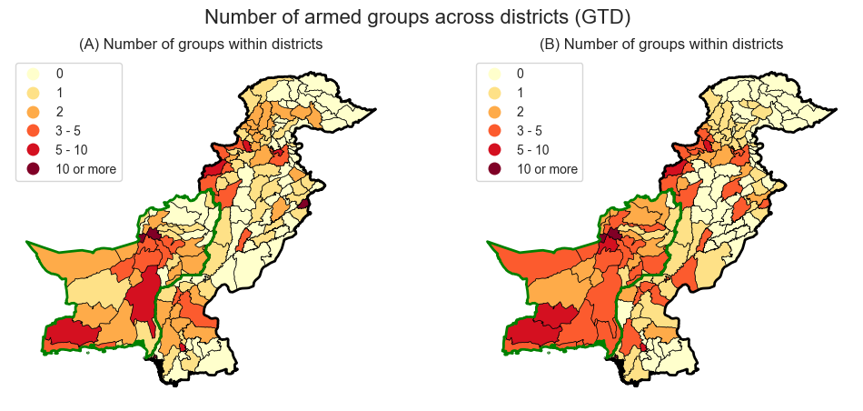

# Replication Exercise: Armed Groups

The aim of this repository is to conduct a replication study of the following research paper:

Gassebner, Martin & Schaudt, Paul & Wong, Melvin H.L., 2023. "Armed groups: Competition and political violence," Journal of Development Economics, Elsevier, vol. 162(C). [Available here](https://doi.org/10.1016/j.jdeveco.2023.103052)

## 🚀 Prerequisites

### Virtual Environment

Create and activate the python virtual environment in the local project folder
 
```bash
python3 -m venv env
source env/bin/activate
```

If this step is successfull the comand line displays the prefix `(env)`. Continue by installing required Python packages
 
```bash
python -m pip install -r requirements.txt
```
 
Note: To create or update the requirements file, please run
 
```bash
pip freeze > requirements.txt
```

### Data Directory

The data used for replication is available under the following links

- [Humanitarian Data Exchange (HDX): Pakistan - Subnational Administrative Boundaries](https://data.humdata.org/dataset/cod-ab-pak?)
- [Global Terrorism Database (GTD)](https://www.start.umd.edu/gtd/)
- [UCDP Georeferenced Event Dataset (GED)](https://ucdp.uu.se/downloads/)

The data directory is structured as follows

```bash
data
├── ged
│   ├── GEDEvent_v23_1.csv
│   └── ged231.pdf
├── gtd
│   ├── Codebook.pdf
│   ├── GTDEULA2022.pdf
│   ├── globalterrorismdb_0522dist.xlsx
│   └── globalterrorismdb_2021Jan-June_1222dist.xlsx
└── pak_adm_wfp_20220909_shp
    ├── pak_admbnda_adm2_wfp_20220909.shp
    └── ...
```

## 📖 Replicated Figures

### Figure 2


### Figure 3


### Figure A-1


### Figure A-7



### Figure A-8


## 💭 Ideas for Next Steps

- Explore variation in the method of attacks